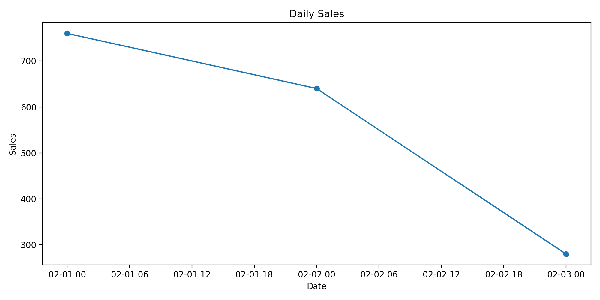
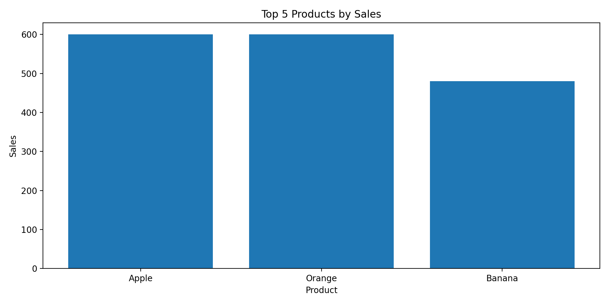

# ログ自動レポート（Log Auto Report）

## 概要
アプリケーションログ（.log / .txt）を自動解析し、  
**ログ件数の集計・可視化・CSV出力** を行う Python ツールです。

手作業でのログ確認や一次分析を自動化することを目的としています。

## Before / After

- **Before**：ログファイルを目視・grepで確認し、件数や傾向を手作業で把握  
- **After**：ログを input/ に置いて実行するだけで、日別件数・レベル別集計・グラフを自動生成

---

## 想定利用シーン

- サーバー / アプリケーションログの一次分析
- INFO / WARN / ERROR の発生傾向を把握したい
- 日別のログ件数を可視化したい
- 障害調査や運用レポート作成の前段階

ログファイルを `input/` に入れて実行するだけで、  
**集計・CSV出力・グラフ生成** までを自動で行います。

---

## フォルダ構成

log_auto_report/
├─ input/      # 解析対象のログファイル（.log / .txt）
├─ output/     # 集計結果（CSV / PNG）
├─ main.py     # メインスクリプト
├─ .gitignore
└─ README.md

---

## 対応ログ形式（例）

```
2026-02-02 12:34:56 INFO Application started
[2026-02-02 12:35:10] [ERROR] Database connection failed
2026-02-02T12:36:01Z WARN Slow response detected
```

---

## 機能

- ログファイルの自動解析
- 日別ログ件数の集計
- ログレベル別（INFO / WARN / ERROR）件数集計
- 集計結果を CSV 形式で出力
- 集計結果をグラフ（PNG）として可視化

---

## 出力内容

### CSV
- `parsed_logs.csv`：パース後のログ一覧
- `daily_counts.csv`：日別ログ件数
- `level_counts.csv`：ログレベル別件数
- `top_messages.csv`：頻出メッセージ上位

## グラフ

### 日別売上


### 売上TOP5


---

## 使い方

### 1. ログファイルを配置

```
input/app.log
```

### 2. 実行

```bash
python3 main.py
```

---

## ✅ 今やる作業（迷わない版）

1. **VSCodeで `README.md` を開く**
2. **今入っている1行を全削除**
3. **↑のREADME全文をコピペ**
4. **保存（Cmd + S）**
5. ターミナルで👇

```bash
git add README.md
git commit -m "Add full README for log auto report"
git push
```